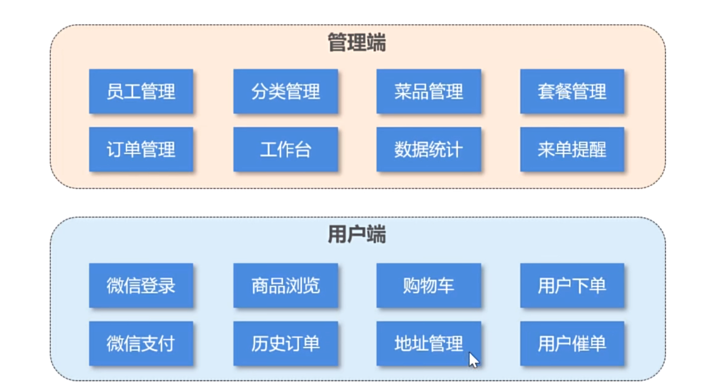

## 软件开发流程  
需求分析——需求规格说明书、产品原型（通过静态页面展示）  
设计——用户界面设计、数据库设计、接口设计   
编码——项目代码、单元测试  
测试——编写测试用列、测试报告  
上线运维——环境、配置   

## 软件环境  
开发环境：开发人员在开发所使用的环境一般外部用户无法访问  
测试环境：专门给测试人员使用的环境，用于测试项目，一般外部用户无法访问  
生产环境：线上环境，正式提供对外服务的环境  
框架图  

### 前端环境搭建  
  
